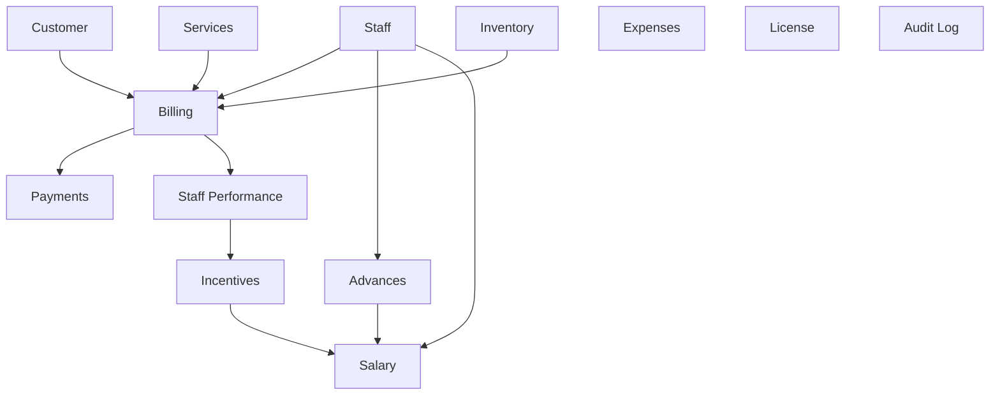

# SalonFlow Track - Phase 2: Domain Model & Database Design

## Overview

This document defines the complete business domain for SalonFlow Track,
designed to replace ALL existing Excel sheets (DSR, PRODUCT, EXP, STAFF ACCOUNT,
INCENTIVES, ADVANCE, SALARY SHEET) with a production-grade data model.

---

## Domain Modules

### 1. Staff Management
| | |
|---|---|
| **Purpose** | Manage salon employees, their roles, availability, and employment lifecycle |
| **Responsibilities** | CRUD staff, track active/inactive status, store employment details, link to performance |
| **Boundary** | Owns Staff entity. Referenced by Billing, Salary, Incentives, Advances |

### 2. Customer Management
| | |
|---|---|
| **Purpose** | Track walk-in and repeat customers for service history and personalization |
| **Responsibilities** | CRUD customers, visit history, preferences, contact details |
| **Boundary** | Owns Customer entity. Referenced by Invoices |

### 3. Services
| | |
|---|---|
| **Purpose** | Define salon service catalog with pricing, duration, and categorization |
| **Responsibilities** | CRUD services, category management, pricing tiers, active/inactive lifecycle |
| **Boundary** | Owns Service, ServiceCategory entities. Referenced by InvoiceItems, IncentiveRules |

### 4. Billing (Invoices)
| | |
|---|---|
| **Purpose** | Generate invoices for customer visits, track line items, discounts, and totals |
| **Responsibilities** | Create invoices, add/remove items, apply discounts, calculate totals, GST (future) |
| **Boundary** | Owns Invoice, InvoiceItem entities. Depends on Customer, Service, Staff |

### 5. Payments
| | |
|---|---|
| **Purpose** | Record payment transactions against invoices |
| **Responsibilities** | Record payment method (cash/card/UPI), partial payments, refunds, settlement |
| **Boundary** | Owns Payment entity. Depends on Invoice |

### 6. Staff Performance (DSR - Daily Sales Report)
| | |
|---|---|
| **Purpose** | Track daily revenue generated by each staff member |
| **Responsibilities** | Aggregate revenue per staff per day, customer count, service breakdown |
| **Boundary** | Read-only aggregate. Derives from InvoiceItems (staff_id + date) |

### 7. Incentives / Commission
| | |
|---|---|
| **Purpose** | Define flexible commission rules and calculate earned incentives |
| **Responsibilities** | Define slab-based and service-based rules, calculate monthly earned commission |
| **Boundary** | Owns IncentiveRule, StaffIncentive entities. Depends on Staff Performance data |

### 8. Salary
| | |
|---|---|
| **Purpose** | Generate monthly salary with base pay, commissions, and deductions |
| **Responsibilities** | Calculate net salary = base + commission - advances - deductions |
| **Boundary** | Owns Salary, SalaryLineItem entities. Depends on Staff, Incentives, Advances |

### 9. Advances
| | |
|---|---|
| **Purpose** | Track salary advances given to staff, deducted from next salary |
| **Responsibilities** | Record advances, track repayment status, link to salary deductions |
| **Boundary** | Owns Advance entity. Referenced by Salary module |

### 10. Expenses
| | |
|---|---|
| **Purpose** | Track all business expenses by category |
| **Responsibilities** | Record expenses, categorize, monthly/yearly totals, receipt tracking |
| **Boundary** | Owns Expense, ExpenseCategory entities. Independent module |

### 11. Inventory / Products
| | |
|---|---|
| **Purpose** | Track product stock, purchases, consumption, and sales |
| **Responsibilities** | Product catalog, stock in/out, consumption during services, low-stock alerts |
| **Boundary** | Owns Product, StockTransaction entities. Referenced by InvoiceItems (product sales) |

### 12. License
| | |
|---|---|
| **Purpose** | Local license validation for subscription enforcement |
| **Responsibilities** | Store license key, validate expiry, grace period handling |
| **Boundary** | Owns License entity. Phase 1 table enhanced |

---

## Aggregate Boundaries

```
┌─────────────────────────────────────────────────────────────────┐
│                        BILLING AGGREGATE                         │
│  Invoice (root) ──► InvoiceItem[] ──► Payment[]                 │
│       │                   │                                      │
│       ▼                   ▼                                      │
│   Customer(ref)     Service(ref) + Staff(ref)                    │
└─────────────────────────────────────────────────────────────────┘

┌─────────────────────────────────────────────────────────────────┐
│                        SALARY AGGREGATE                          │
│  Salary (root) ──► SalaryLineItem[]                             │
│       │                                                          │
│       ▼                                                          │
│   Staff(ref) ──► Incentives(ref) + Advances(ref)                │
└─────────────────────────────────────────────────────────────────┘

┌─────────────────────────────────────────────────────────────────┐
│                      INVENTORY AGGREGATE                         │
│  Product (root) ──► StockTransaction[]                          │
└─────────────────────────────────────────────────────────────────┘

┌─────────────────────────────────────────────────────────────────┐
│                     INCENTIVE AGGREGATE                          │
│  IncentiveRule (root) ──► IncentiveRuleSlab[]                   │
│  StaffIncentive (calculated)                                     │
└─────────────────────────────────────────────────────────────────┘
```

## Module Dependencies


