# Entity Relationship Diagram

## Complete ER Diagram

```mermaid
erDiagram
    %% ===== CORE ENTITIES =====
    
    users {
        TEXT id PK "UUIDv7"
        TEXT name
        TEXT email UK
        TEXT phone
        TEXT role "admin, operator"
        INTEGER is_active
        DATETIME created_at
        DATETIME updated_at
        DATETIME deleted_at
    }

    staff {
        TEXT id PK "UUIDv7"
        TEXT name
        TEXT phone
        TEXT role "stylist, assistant, receptionist"
        REAL base_salary "Monthly base"
        INTEGER is_active
        DATETIME joined_at
        TEXT specialties "JSON array"
        DATETIME created_at
        DATETIME updated_at
        DATETIME deleted_at
    }

    customers {
        TEXT id PK "UUIDv7"
        TEXT name
        TEXT phone UK
        TEXT email
        TEXT gender "male, female, other"
        DATE date_of_birth
        TEXT notes
        INTEGER visit_count
        DATETIME last_visit_at
        INTEGER is_active
        DATETIME created_at
        DATETIME updated_at
        DATETIME deleted_at
    }

    %% ===== SERVICE CATALOG =====

    service_categories {
        TEXT id PK "UUIDv7"
        TEXT name
        TEXT description
        INTEGER sort_order
        INTEGER is_active
        DATETIME created_at
        DATETIME updated_at
        DATETIME deleted_at
    }

    services {
        TEXT id PK "UUIDv7"
        TEXT category_id FK
        TEXT name
        TEXT description
        INTEGER duration "minutes"
        REAL price
        INTEGER is_active
        DATETIME created_at
        DATETIME updated_at
        DATETIME deleted_at
    }

    %% ===== BILLING =====

    invoices {
        TEXT id PK "UUIDv7"
        TEXT invoice_number UK "INV-YYYYMM-XXXX"
        TEXT customer_id FK
        DATE date
        REAL subtotal
        TEXT discount_type "none, percentage, fixed"
        REAL discount_value
        REAL discount_amount
        REAL tax_amount
        REAL total_amount
        REAL paid_amount
        TEXT status "draft, completed, cancelled"
        TEXT payment_status "unpaid, partial, paid"
        TEXT notes
        DATETIME created_at
        DATETIME updated_at
        DATETIME deleted_at
    }

    invoice_items {
        TEXT id PK "UUIDv7"
        TEXT invoice_id FK
        TEXT item_type "service, product"
        TEXT service_id FK "nullable"
        TEXT product_id FK "nullable"
        TEXT staff_id FK
        TEXT name "denormalized"
        INTEGER quantity
        REAL unit_price
        REAL discount
        REAL total_price
        DATETIME created_at
        DATETIME updated_at
    }

    %% ===== PAYMENTS =====

    payments {
        TEXT id PK "UUIDv7"
        TEXT invoice_id FK
        REAL amount
        TEXT method "cash, card, upi"
        TEXT reference_no
        DATETIME paid_at
        TEXT notes
        INTEGER is_refund
        DATETIME created_at
        DATETIME updated_at
        DATETIME deleted_at
    }

    %% ===== EXPENSES =====

    expense_categories {
        TEXT id PK "UUIDv7"
        TEXT name
        TEXT description
        INTEGER is_default
        INTEGER is_active
        DATETIME created_at
        DATETIME updated_at
        DATETIME deleted_at
    }

    expenses {
        TEXT id PK "UUIDv7"
        TEXT category_id FK
        REAL amount
        DATE date
        TEXT description
        TEXT paid_to
        TEXT paid_by
        TEXT receipt_path
        DATETIME created_at
        DATETIME updated_at
        DATETIME deleted_at
    }

    %% ===== ADVANCES =====

    advances {
        TEXT id PK "UUIDv7"
        TEXT staff_id FK
        REAL amount
        REAL recovered_amount
        REAL balance_amount
        DATE date
        TEXT reason
        TEXT status "pending, partial, recovered"
        TEXT approved_by
        DATETIME created_at
        DATETIME updated_at
        DATETIME deleted_at
    }

    %% ===== INCENTIVES =====

    incentive_rules {
        TEXT id PK "UUIDv7"
        TEXT name
        TEXT type "revenue_slab, service_based, product_sale"
        TEXT period "daily, weekly, monthly"
        TEXT service_id FK "nullable"
        TEXT category_id FK "nullable"
        TEXT staff_id FK "nullable, null=all"
        INTEGER is_active
        DATE effective_from
        DATE effective_to "nullable"
        DATETIME created_at
        DATETIME updated_at
        DATETIME deleted_at
    }

    incentive_rule_slabs {
        TEXT id PK "UUIDv7"
        TEXT rule_id FK
        REAL min_amount
        REAL max_amount "nullable"
        TEXT commission_type "percentage, fixed"
        REAL commission_value
        INTEGER sort_order
        DATETIME created_at
        DATETIME updated_at
    }

    staff_incentives {
        TEXT id PK "UUIDv7"
        TEXT staff_id FK
        TEXT rule_id FK
        DATE period_start
        DATE period_end
        REAL revenue_amount
        REAL incentive_amount
        TEXT status "calculated, approved, paid"
        TEXT approved_by
        DATETIME approved_at
        DATETIME created_at
        DATETIME updated_at
    }

    %% ===== SALARY =====

    salaries {
        TEXT id PK "UUIDv7"
        TEXT staff_id FK
        INTEGER month "1-12"
        INTEGER year
        REAL base_salary
        REAL total_earnings
        REAL total_deductions
        REAL net_salary
        TEXT status "draft, approved, paid"
        DATETIME paid_at
        TEXT paid_via "cash, bank_transfer"
        TEXT notes
        TEXT generated_by
        TEXT approved_by
        DATETIME created_at
        DATETIME updated_at
        DATETIME deleted_at
    }

    salary_line_items {
        TEXT id PK "UUIDv7"
        TEXT salary_id FK
        TEXT type "base_pay, commission, bonus, advance_deduction, other_deduction, other_earning"
        TEXT description
        REAL amount "positive=earning, negative=deduction"
        TEXT reference_id FK "nullable, links to advance/incentive"
        INTEGER sort_order
        DATETIME created_at
        DATETIME updated_at
    }

    %% ===== INVENTORY =====

    products {
        TEXT id PK "UUIDv7"
        TEXT name
        TEXT brand
        TEXT sku UK
        TEXT category
        TEXT unit "ml, g, piece, bottle"
        REAL cost_price
        REAL selling_price
        REAL current_stock
        REAL min_stock_level
        INTEGER is_active
        INTEGER is_for_sale
        DATETIME created_at
        DATETIME updated_at
        DATETIME deleted_at
    }

    stock_transactions {
        TEXT id PK "UUIDv7"
        TEXT product_id FK
        TEXT type "purchase, consumption, sale, adjustment, return, damage"
        REAL quantity "positive=in, negative=out"
        REAL unit_cost
        REAL total_cost
        REAL balance_after
        TEXT reference_type "invoice, manual"
        TEXT reference_id FK "nullable"
        TEXT notes
        TEXT performed_by
        DATE transaction_date
        DATETIME created_at
        DATETIME updated_at
    }

    %% ===== SYSTEM =====

    audit_logs {
        TEXT id PK "UUIDv7"
        TEXT entity_type
        TEXT entity_id
        TEXT action "create, update, delete, approve"
        TEXT performed_by
        TEXT old_value "JSON"
        TEXT new_value "JSON"
        TEXT ip_address
        TEXT user_agent
        DATETIME created_at
    }

    license {
        TEXT id PK "UUIDv7"
        TEXT license_key
        DATETIME expiry_date
        TEXT status "active, expired, revoked"
        TEXT issued_to
        DATETIME issued_at
        DATETIME created_at
        DATETIME updated_at
    }

    settings {
        TEXT id PK "UUIDv7"
        TEXT key UK
        TEXT value
        TEXT description
        TEXT category
        DATETIME created_at
        DATETIME updated_at
    }

    %% ===== RELATIONSHIPS =====

    services ||--o{ service_categories : "belongs to"
    invoices ||--o{ customers : "billed to"
    invoice_items }o--|| invoices : "belongs to"
    invoice_items }o--o| services : "for service"
    invoice_items }o--o| products : "for product"
    invoice_items }o--|| staff : "performed by"
    payments }o--|| invoices : "pays"
    expenses }o--|| expense_categories : "categorized"
    advances }o--|| staff : "given to"
    incentive_rules ||--o{ incentive_rule_slabs : "has slabs"
    incentive_rules }o--o| services : "applies to"
    incentive_rules }o--o| staff : "applies to"
    staff_incentives }o--|| staff : "earned by"
    staff_incentives }o--|| incentive_rules : "from rule"
    salaries }o--|| staff : "paid to"
    salary_line_items }o--|| salaries : "part of"
    stock_transactions }o--|| products : "for product"
```

## Key Relationships Summary

| Parent | Child | Relationship | Cardinality |
|--------|-------|-------------|-------------|
| Customer | Invoice | Customer has many invoices | 1:N |
| Invoice | InvoiceItem | Invoice has many line items | 1:N |
| Invoice | Payment | Invoice has many payments | 1:N |
| Service | InvoiceItem | Service appears in many items | 1:N |
| Staff | InvoiceItem | Staff performs many services | 1:N |
| Staff | Advance | Staff has many advances | 1:N |
| Staff | Salary | Staff has monthly salaries | 1:N |
| Staff | StaffIncentive | Staff earns incentives | 1:N |
| Salary | SalaryLineItem | Salary has breakdown items | 1:N |
| IncentiveRule | IncentiveRuleSlab | Rule has many slabs | 1:N |
| Product | StockTransaction | Product has stock history | 1:N |
| ExpenseCategory | Expense | Category has many expenses | 1:N |
| ServiceCategory | Service | Category has many services | 1:N |
